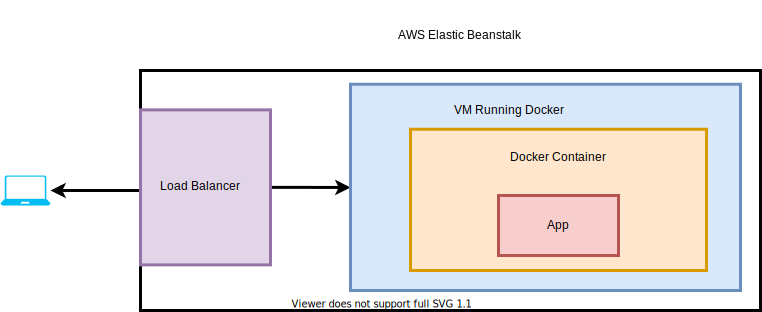

## CICD in AWS

## Github ⇒ Travis CI ⇒ AWS

```yaml
sudo: required
services:
  - docker
# when you specify build context, you should set build file and build folder.
# For example, '-f ./folder/Dockerfile.dev ./folder'
before_install:
  - docker build -t <repo_name>/<app_name> -f Dockerfile.dev .

script:
	- docker run -e CI=true <repo_name>/<app_name> npm run test
```

Set up a `.travis.yml` file in the directory, and setup docker.

```yaml
CI=true npm test
CI=true npm run build
```

The test command will force Jest to run in CI-mode, and tests will only run once instead of launching the watcher.

For non-CI environments, you can pass the `--watchAll=false` flag to disable test-watching.



**When creating our Elastic Beanstalk environment in the next lecture, we need to select Docker running on 64bit Amazon Linux instead of Docker running on 64bit Amazon Linux 2.** This will ensure that our container is built using the Dockerfile and not the compose file.

### Deploy phase in travis yml

```yaml
deploy:
	provider: elasticbeanstalk
	region: <your region when you create your instance>
	app: <your application name>
	env: <your app env> # often xxx-env
	# aws will copy your zip file into s3 bucket
	bucket_name: <your s3 name> # eb already creates a s3 for you
	bucket_path: <might be your app name>
	on: # only action when master is changed
		branch: master
```

1. access_key_id: $AWS_ACCESS_KEY
2. secret_access_key: $AWS_SECRET_KEY

### IAM

IAM is use for manage API keys.

First you have to add user for the travis CI. After that, you have to define policies for the travis CI to deploy the app. Currently, use admin-access policy will work. You will then have a secret key specific to this user. DO NOT paste is directly on the `.travis.yml` file but rather put it into travis-ci website.

Noted that, if your app folder is not in the same folder of your `.travis.yml` file, you should specify a  before_deploy script to cd into that folder in order for the build to complete.

```yaml
before_deploy:
  - cd ./<your app folder>
```