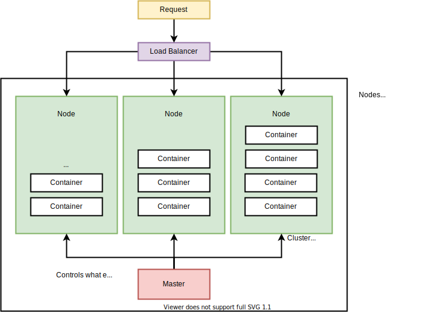
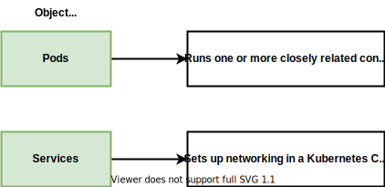

It solves the problem of controlling how to scale individual services to the desire quantity.

K8s is use to make system to run many different containers over multiple different machines.

There are two types of method working with Kubernetes. In development, you would use **minikube** while in production, you would use `Amazon Elastic Container Service for Kubernetes` or `Google Cloud Kubernetes Engine`.

When you setup a local environment in your local machine, you use minikube solely for creating a VM. kubectl is used for managing containers in the node.

Key difference between docker compose and k8s

- k8s expects your built image
- k8s has each object a config file
- You have to manually set up network in k8s

### K8s yml files

### kind

Making specific Object Types in kubernetes. 

- Stateful
- ReplicaController
- Pod
- Service

Object server different purposes. Whether is to run a container, monitoring a container or setting up networking.

### apiVersion

defines what types of object you can use inside the k8s.

`v1`

- componentStatus
- configMap
- Endpoints
- Event
- Namespace
- Pod

`app/v1`

- ControllerRevision
- StatefulSet

## Pod

A pod is a group of containers that has to be working together. Tight intergration and has to be excecute together.

## metadata

For logging purposes.

You can also define `label` (a key pair like `component: web`)to use k8s's selector funtion to specify which component you would want to apply the setting to.

In NodeService, port is for other pod that needs to access this port. targetPort is the port you want your traffic goes to. nodePort is for developer to access locally(30000-32767).

Anytime you want to access the dev environment, you must enter the VM ip address and not you localhost.

### Summary

1. Kubernetes is a system to deploy **containerized** apps
2. **Nodes** are individual machines that run containers
3. **Masters** are machines with a set of programs to manage nodes
4. Kubernetes didn't build out image but get it from somewhere else
5. Kubernetes decided where to run each container, each node can run a dissimilar set of containers
6. To deploy something, we update the desired state of the master with a config file
7. The master works constantly to meet your desired state.