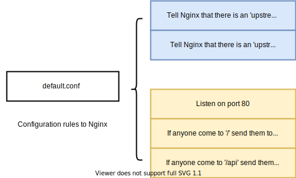
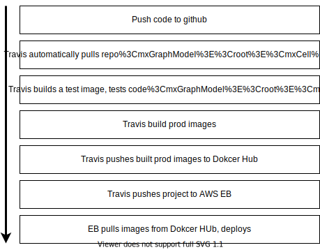
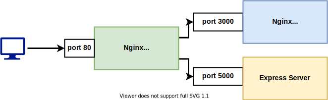

# Multi-container application

Rebuild if you change any of the docker-compose.yml

When you use build, you should specify the name of the Dockerfile you want to use and also the build context where you want to build your image.

```yaml
build:
	context: <directory> # default is a dot mean current directory
	dockerfile: <dockerfile to use>
```

When you run the image, setting up environment variables as `variableName=value` is to set a variable in the contiainer at **run time**.

If you only specify `varaibleName` , values will be taken from **your computer**.

## Purpose of Nginx

Dev environment use of nginx is to enforce routing with different request. For example, index.html and *.js file will go to React server while internet requests goes to the Express server.

So the role of Nginx is to decide which request goes to which server.

You don't want to make every request bind to a specify port because the port is easily change. Instead, you would want to specify a route and let nginx figure out which destination service it should go to.



In a typical production environment, it is common to have multiple Nginx server to handle different route.





In the above example, the Nginx listen for `port 80` is specific for handle browser requests while the second Nginx which listen to `port 3000` is for handling production build react application files.

When you push your code to dockerhub, make sure your username is the same. `<username>/<image>` This username should match your docker hub username.