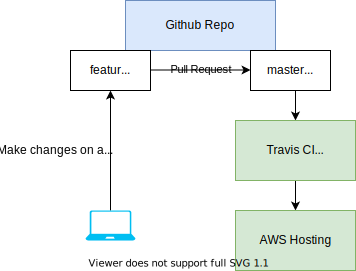
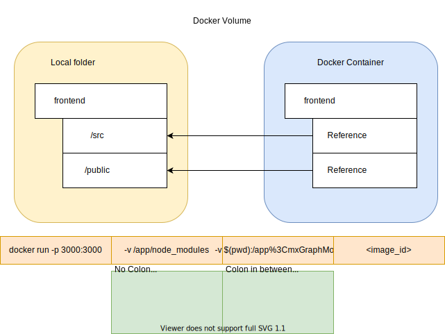
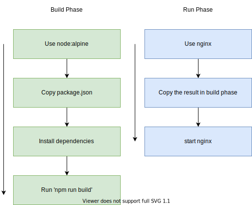

- start - dev env
- test - test env
- build - production env



It is usually two docker file in one project, one is for development and one is for production.

Whenever you run docker build, docker is looking for file named Docker file. If you use custom file, you should use the -f argument.

`docker build -f Dockerfile.dev`

## Docker Volume

In dev, you will want your code change propagated into the dev environment without rebuild the container.



### Bookmarking volumes

When using colon notation, it means we want to map folder inside container to outside container. If we do not use colon, we mean don't map it to outside folder and stay as it is.  

```yaml
version: '3'
servives:
  web:
    # when you use custom filename
    build:
      # Looking into the current directory
      context: .
      # File name of the dockerfile you want
      dockerfile: Dockerfile.dev 
```

You could attach to the exisiting container to test the app simply by typing `docker exec <container_id> -it npm run test`

### stdin

Container inside will have its own stdin stdout stderr for each process and it is not visible by the outside by default.

stdin only attach to the primary process, when you run, your main process is npm, but npm inside the container creates a second process to run the test, as a result, when you operate from outside, you are only controlling the main process. (You can use `ps` command in the shell  to see processes)

### Prod Environment

Use production server instead of dev server when you are developing. Because dev server performs a lot of task that is specifically focus on dev and is not optimized for production. 

One of the production server is nginx

### Nginx



Implementing Multi step build process

specify a stage by using `FROM <baseimage> as <stage>` keyword.
