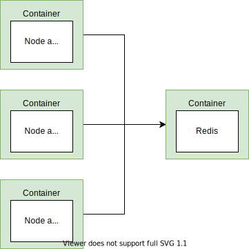

### Docker compose

`docker-compose` Automates docker run with multiple containers.

```docker
# Rebuild image
docker-compose up --build

# Run existing image, -d is for background
docker-compose up -d

# Stop
docker-compose down
```

Net work is automatically handle by docker compose. You only have to specify the name of the services in the app.

`process.exit(0)` In node application, exit code 0 mean everything is Ok and we wanted this application to be close.

```yaml
version: '3'
servives:
	node-app:
		restart: always
# always means always restart.
# on-faluire means only faluire will restart.
# "no" should be in quote, in yml, no is a reserved word means false.
```

`docker-compose ps` To view status of the services. This command should be run at the same context as your docker-compose.yml. whereas docker ps will look for all the container currently running.
